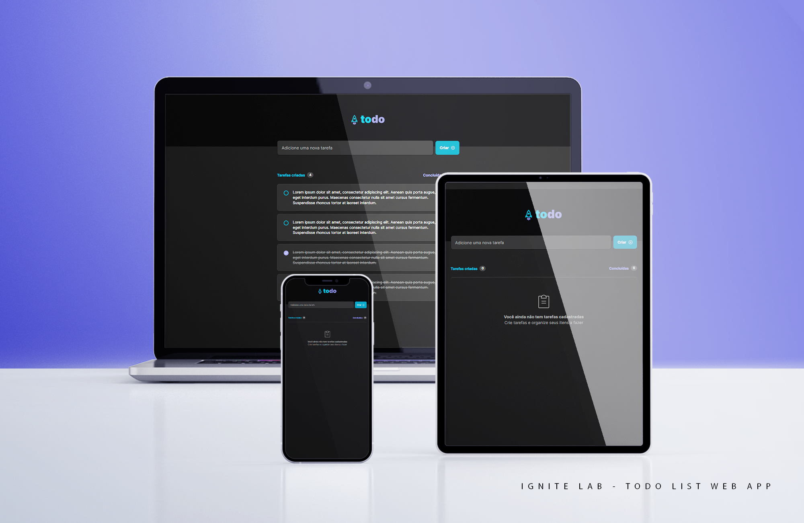

### 🚀 React Native Ignite 2022 - Chalange 01: ToDo App

##### This project was created as a requirement to complete the first module of the bootcamp. I was given a [documentation](hhttps://efficient-sloth-d85.notion.site/Desafio-01-Praticando-os-conceitos-do-ReactJS-91fd63dd1a5b4a2796152de293ec1074) and a [design](https://www.figma.com/file/0n0zDN7zbzhRbaEO74Xesx/ToDo-List) and based on those I had to develop the app from scratch.

 

### 💻 Screenshots

 

### 🔎 Live View

- [Live link](https://todo-app-eight-tawny.vercel.app)

 

### 🎯 Project Goal

The goal was to implement concepts learned on the bootcamp's first module - such as CSS Modules, componentization, the use of Hooks, etc - stronger, learn new ways of doing a few old things and to implement Typescript in an aplication from scratch, without guidance. The icons might be a little different from the design because I decided to work with [Phosphor Icon Library](https://phosphoricons.com) and it feels super easy. :)

 

### ⚒️ Built With

  
